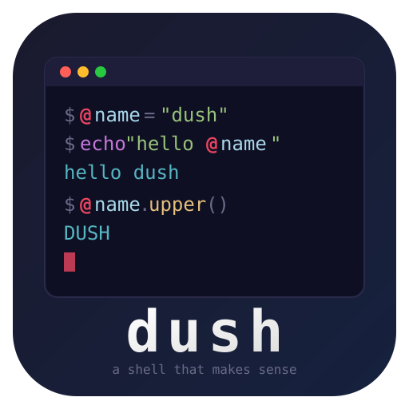

# Dush



A modern shell written in Go with a scripting language that actually makes sense.

Dush replaces the cryptic `${}` syntax of bash with a clean `@` sigil system. Variables are explicit, methods are chainable, and commands just work.

## Quick Look

```bash
@name = "world"
echo "hello @name"             # hello world
echo @name.upper()             # WORLD

const @PI = 3.14               # immutable
pub @KEY = "abc"               # exported to child processes

match (@status) {
    case 0 { echo "ok" }
    case _ { echo "fail" }
}

proc greet(@who) {
    echo "hey @who!"
}
greet("dush")

sleep 30 &                     # background job
jobs                           # list running jobs
```

## Features

- **`@` variable system** -- unambiguous access everywhere (code, commands, strings)
- **Data types** -- integers, floats, strings, booleans, arrays
- **String interpolation** -- `"hello @name"` just works, `'raw @string'` doesn't
- **Method syntax** -- `@name.upper()`, `@text.split(",")`, `@n.abs()`
- **`match-case`** -- pattern matching with `case _` wildcard
- **`const` / `pub`** -- immutability and export as language keywords
- **Shell variables** -- `@LAST_STATUS`, `@OS_NAME`, `@SHELL_PID` (read-only)
- **Procedures** -- first-class, closures, recursion
- **Loops** -- conditional (`loop (@i < 10)`) and iterator (`loop (@x : @items)`)
- **Command chaining** -- `&&`, `||`, pipes `|`, redirects `>`, `>>`
- **Background jobs** -- `command &`, `jobs`, `fg`, `killjob`, `cleanjobs`
- **Output capture** -- `let @out = save(echo "hi")`
- **Scoped env** -- `with (@NODE_ENV = "prod") { ... }`
- **String/array/number methods** -- trim, replace, split, join, contains, slice, abs, etc.
- **Customizable prompt** -- oh-my-zsh style `{tokens}` with ANSI colors, git branch, time
- **Modern `ls`** -- icons, colors, grid/table layout, human-readable sizes, sorting
- **Interactive shell** -- history, tab completion, `~/.dush/` config
- **Cross-platform** -- Windows, Linux, macOS

## Install

### Prerequisites
- Go 1.21+

### Build

```bash
# With gobake (recommended)
gobake build

# Or manually
go build -o build/dush ./cmd/dush
```

Binaries output to `build/`.

### Run

```bash
./build/dush
```

## The `@` System

Every variable uses `@`. No exceptions, no ambiguity.

```bash
@x = 10                        # assign
let @x = 10                    # explicit local scope
const @MAX = 100               # immutable
pub @KEY = "secret"            # exported to child processes
pub const @VER = "2.0"         # exported + immutable
```

Bare identifiers are always string literals in commands:
```bash
echo hello                     # prints "hello" (literal)
echo @name                     # prints value of name
```

### String Interpolation

```bash
@lang = "dush"
echo "welcome to @lang"        # welcome to dush
echo 'no @interpolation'       # no @interpolation
```

## Data Types

### Integer

Whole numbers, positive or negative.

```bash
@x = 42
@y = -10
@z = @x + @y                  # 32
@z = @x * 2                   # 84
@z = @x / 5                   # 8
@z = @x % 10                  # 2

@n = -5
@n.abs()                       # 5
@n.to_string()                 # "-5"
```

### Float

Decimal numbers. Mixed int/float arithmetic produces floats.

```bash
@pi = 3.14
@radius = 5
@area = @pi * @radius * @radius   # 78.5

@x = 7.0 / 2.0                # 3.5
@y = 1 + 2.5                  # 3.5 (int + float = float)

@f = -3.7
@f.abs()                       # 3.7
@f.to_string()                 # "-3.7"
```

### String

Double-quoted strings support `@` interpolation. Single-quoted strings are raw.

```bash
@name = "world"
@greeting = "hello @name"      # "hello world"
@raw = 'hello @name'           # "hello @name" (no interpolation)
@empty = ""

# Concatenation
@full = "hello" + " " + "world"

# Comparison
"abc" == "abc"                 # true
"abc" < "def"                  # true (lexicographic)
```

**String methods:**

| Method | Returns | Example |
|---|---|---|
| `.upper()` | String | `"hello".upper()` → `"HELLO"` |
| `.lower()` | String | `"HELLO".lower()` → `"hello"` |
| `.len()` | Integer | `"hello".len()` → `5` |
| `.trim()` | String | `"  hi  ".trim()` → `"hi"` |
| `.trim_start()` | String | `"  hi  ".trim_start()` → `"hi  "` |
| `.trim_end()` | String | `"  hi  ".trim_end()` → `"  hi"` |
| `.contains(s)` | Boolean | `"hello".contains("ell")` → `true` |
| `.starts_with(s)` | Boolean | `"hello".starts_with("he")` → `true` |
| `.ends_with(s)` | Boolean | `"hello".ends_with("lo")` → `true` |
| `.replace(old, new)` | String | `"hello".replace("l", "r")` → `"herlo"` |
| `.replace_all(old, new)` | String | `"hello".replace_all("l", "r")` → `"herro"` |
| `.split(sep)` | Array | `"a,b,c".split(",")` → `["a","b","c"]` |
| `.slice(start, end)` | String | `"hello".slice(1, 4)` → `"ell"` |
| `.or(default)` | String | `"".or("fallback")` → `"fallback"` |
| `.to_string()` | String | identity |

### Boolean

```bash
@flag = true
@other = false

@x = 1 < 2                    # true
@y = 10 == 10                  # true
@z = !@flag                    # false
```

### Array

Arrays are created by functions like `split()`. They hold ordered elements.

```bash
@arr = split("a,b,c", ",")    # ["a", "b", "c"]
@arr.len()                     # 3
@arr.join(" | ")               # "a | b | c"
@arr.contains("b")            # true

# Iterate
loop (@item : @arr) {
    echo @item
}
```

**Array methods:**

| Method | Returns | Example |
|---|---|---|
| `.len()` | Integer | `@arr.len()` → `3` |
| `.join(sep)` | String | `@arr.join(",")` → `"a,b,c"` |
| `.contains(val)` | Boolean | `@arr.contains("b")` → `true` |

### Type Conversion

```bash
int(3.7)                       # 3
int("42")                      # 42
int(true)                      # 1

float(3)                       # 3.0
float("3.14")                  # 3.14

type(42)                       # "INTEGER"
type("hello")                  # "STRING"
type(true)                     # "BOOLEAN"
type(3.14)                     # "FLOAT"
```

## Methods

```bash
@s = "hello world"
@s.upper()                     # HELLO WORLD
@s.split(" ")                  # [hello, world]
@s.len()                       # 11
@s.contains("world")           # true
@s.replace("world", "dush")   # hello dush
@s.slice(0, 5)                 # hello

@arr = split("a,b,c", ",")
@arr.join(" | ")               # a | b | c
@arr.len()                     # 3

@n = -42
@n.abs()                       # 42

# Chaining
@s = "  HELLO  "
@s.trim().lower()              # "hello"
```

### Shell Variables (read-only)

```bash
@LAST_STATUS    # exit code of last command
@OS_NAME        # windows / linux / darwin
@USER_NAME      # current user
@HOME_DIR       # home directory
@WORKING_DIR    # current working directory
@SHELL_PID      # process ID
@SHELL_VERSION  # dush version
```

## Control Flow

### If / Else

```bash
if (@score > 90) {
    echo "A"
} else {
    echo "not A"
}
```

### Match / Case

```bash
match (@code) {
    case 0 { echo "success" }
    case 1 { echo "error" }
    case _ { echo "unknown" }
}
```

### Loops

```bash
# Conditional
@i = 0
loop (@i < 10) {
    @i = @i + 1
}

# Iterator (range)
loop (@i : 5) { echo @i }         # 0 1 2 3 4

# Iterator (array)
loop (@item : @items) { echo @item }
```

## Procedures

```bash
proc add(@a, @b) {
    return @a + @b
}
add(2, 3)    # 5

# First-class
let @double = proc(@x) { @x * 2 }
@double(21)  # 42

# Closures
proc make_adder(@n) {
    return proc(@x) { @x + @n }
}
let @add5 = make_adder(5)
@add5(10)    # 15
```

## Shell Integration

```bash
# Commands
git status
ls -la

# Dotted command names work
atlas.ed file.txt
node.exe script.js

# Dot-prefixed arguments work
cd .config
ls .hidden

# Chaining
echo "a" && echo "b"          # both run
echo "a" || echo "b"          # only first runs

# Pipes and redirects
ls | grep go
echo "log" >> output.txt

# Output capture
let @files = save(ls)

# Scoped environment
with (@NODE_ENV = "production") {
    echo @NODE_ENV
}
```

### Background Jobs

Run any command in the background with `&`:

```bash
sleep 30 &                     # [1] 12345
ping localhost &               # [2] 12346
ls | grep go &                 # pipes work too
```

**Job management builtins:**

| Command | Description |
|---|---|
| `jobs` | List all background jobs with status and PID |
| `fg <id>` | Wait for a background job to finish (bring to foreground) |
| `killjob <id>` | Kill a running background job |
| `cleanjobs` | Remove finished jobs from the list |

```bash
sleep 60 &                     # [1] 54321
jobs                           # [1]  running  PID 54321  sleep 60
killjob 1                      # kills the job
cleanjobs                      # removes finished entries
```

## Modern `ls`

Dush ships with a built-in `ls` that's colorful, icon-rich, and modern (inspired by [eza](https://github.com/eza-community/eza)).

```
ls                             # grid view with icons and colors
ls -l                          # long format with header, perms, size, owner
ls -la                         # include hidden (dot) files
ls -lS                         # long format, sorted by size
ls -lt                         # long format, sorted by time
```

**Features:**
- File-type icons (folders, Go, Python, Rust, JS, archives, images, etc.)
- Colored file names by type (directories bold blue, executables green, etc.)
- Colored permissions (`r` yellow, `w` red, `x` green)
- Human-readable file sizes (`1.2M`, `340K`, `5.1G`)
- Table header in long format
- Grid layout that adapts to terminal width
- Sorting by name (default), size (`-S`), time (`-t`), or extension (`-X`)
- Reverse sort (`-r`)

**Flags:**

| Flag | Long | Description |
|---|---|---|
| `-l` | `--long` | Long table format with details |
| `-a` | `--all` | Show hidden (dot) files |
| `-1` | `--oneline` | One entry per line |
| `-r` | `--reverse` | Reverse sort order |
| `-S` | `--sort=size` | Sort by file size |
| `-t` | `--sort=time` | Sort by modification time |
| `-X` | `--sort=ext` | Sort by file extension |
| | `--no-header` | Hide the table header |
| | `--no-icons` | Hide file type icons |

## Project Structure

```
dush/
  cmd/
    dush/          # main shell binary
    shout/         # echo-like utility
    ports/         # cross-platform port scanner
  internal/
    parser/        # lexer, tokens, AST, Pratt parser
    evaluator/     # tree-walking evaluator, environment, methods, jobs
    prompt/        # customizable prompt renderer with ANSI colors
    builtins/      # built-in shell commands (cd, ls, pwd, jobs, fg, etc.)
    repl/          # interactive shell with history + tab completion
    app/           # global app state
    config/        # defaults and runtime config
    utils/         # utilities (history, colors, display)
  examples/
    showcase.dush  # comprehensive language demo
  Recipe.go        # gobake build recipe
  LANGUAGE_SPEC.md # full language specification
```

## Bundled Utilities

- **shout** -- like `echo`, but ours
- **ports** -- cross-platform open port scanner (Windows/Linux/macOS native APIs)

## CLI Usage

```
dush                          # interactive mode
dush script.dush              # run a script (non-interactive)
dush -v / --version           # print version
dush -h / --help              # print help
```

### Path override flags

```
dush --env <path>             # override env file (default: ~/.dush/env)
dush --is <path>              # override is file (default: ~/.dush/is)
dush --history <path>         # override history file (default: ~/.dush/history)
```

Useful for testing or running isolated sessions:
```bash
dush --env ./test/env --is /dev/null --history /tmp/h examples/showcase.dush
```

## Configuration

All config lives in `~/.dush/`:

| File | Loaded | Purpose |
|---|---|---|
| `~/.dush/env` | Always (interactive + scripts) | Environment setup, pub vars, prompt config |
| `~/.dush/is` | Interactive only | Aliases, greeting, shell helpers |
| `~/.dush/history` | Interactive only | Command history (auto-managed) |

**Loading order:** `env` first, then `is`.

### Non-interactive mode

`dush script.dush` only sources `~/.dush/env`, skipping `~/.dush/is`. Scripts run fast without interactive setup.

## Prompt

The prompt is fully customizable via `@PROMPT_LINE` in `~/.dush/env`. It uses `{token}` syntax inspired by oh-my-zsh.

### Default prompt

```
@PROMPT_LINE = '{fg:cyan}{user}{reset}@{fg:green}{dir}{reset} {fg:yellow}${reset} '
```

### Content tokens

| Token | Output |
|---|---|
| `{user}` | Current username |
| `{host}` | Machine hostname |
| `{dir}` | Current directory basename |
| `{path}` | Full absolute path |
| `{home_path}` | Path with `~` replacing home dir |
| `{time}` | Current time `15:04:05` |
| `{date}` | Current date `2006-01-02` |
| `{git}` | Git branch name (empty if not in a repo) |
| `{last_status}` | Exit code of the last command |
| `{os}` | Operating system (`windows`, `linux`, `darwin`) |
| `{newline}` | Line break (for multi-line prompts) |

### Color and style tokens

| Token | Effect |
|---|---|
| `{fg:red}` | Set foreground to a named color |
| `{bg:blue}` | Set background to a named color |
| `{fg:#ff5500}` | Set foreground to a hex color (true-color) |
| `{bg:#1a1a2e}` | Set background to a hex color (true-color) |
| `{reset}` | Reset all colors and styles |
| `{bold}` | Bold text |
| `{dim}` | Dim/faint text |
| `{italic}` | Italic text |
| `{underline}` | Underlined text |

**Named colors:** `black`, `red`, `green`, `yellow`, `blue`, `magenta`, `cyan`, `white` -- plus `bright_black` through `bright_white`.

### Continuation prompt

For multi-line input (open braces, etc.):

```
@CONTINUATION_PROMPT = '{fg:yellow}...{reset} '
```

### Example prompts

```bash
// Minimal
@PROMPT_LINE = '$ '

// Classic user@host:path
@PROMPT_LINE = '{fg:green}{user}{reset}@{host}:{fg:blue}{home_path}{reset}$ '

// With git branch
@PROMPT_LINE = '{fg:cyan}{user}{reset}:{fg:blue}{home_path}{reset} ({fg:magenta}{git}{reset}) $ '

// Two-line with timestamp
@PROMPT_LINE = '{fg:dim}{time}{reset} {fg:cyan}{user}{reset}@{host}:{fg:yellow}{home_path}{reset}{newline}{fg:green}${reset} '

// Powerline-style with hex colors
@PROMPT_LINE = '{bg:#1a1a2e}{fg:#ff6b6b} {user} {reset}{bg:#16213e}{fg:#a8d8ea} {home_path} {reset}{fg:yellow} > {reset}'

// Show last exit code when non-zero
@PROMPT_LINE = '{fg:red}{last_status}{reset} {fg:cyan}{dir}{reset} $ '
```

### Example `~/.dush/env`

```bash
pub @EDITOR = "vim"
pub @LANG = "en_US.UTF-8"
@PROMPT_LINE = '{fg:cyan}{user}{reset}@{fg:green}{dir}{reset} $ '
```

### Example `~/.dush/is`

```bash
alias ll='ls -la'
alias gs='git status'
echo "Welcome back, @USER_NAME!"
```

## License

MIT
